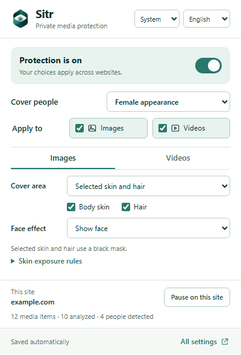
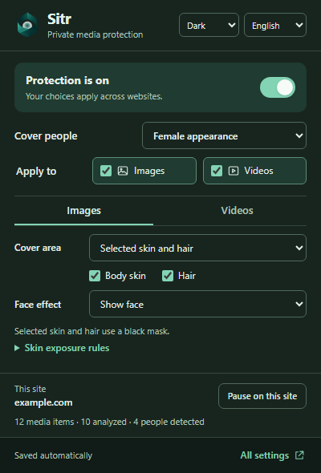
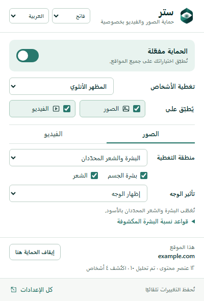
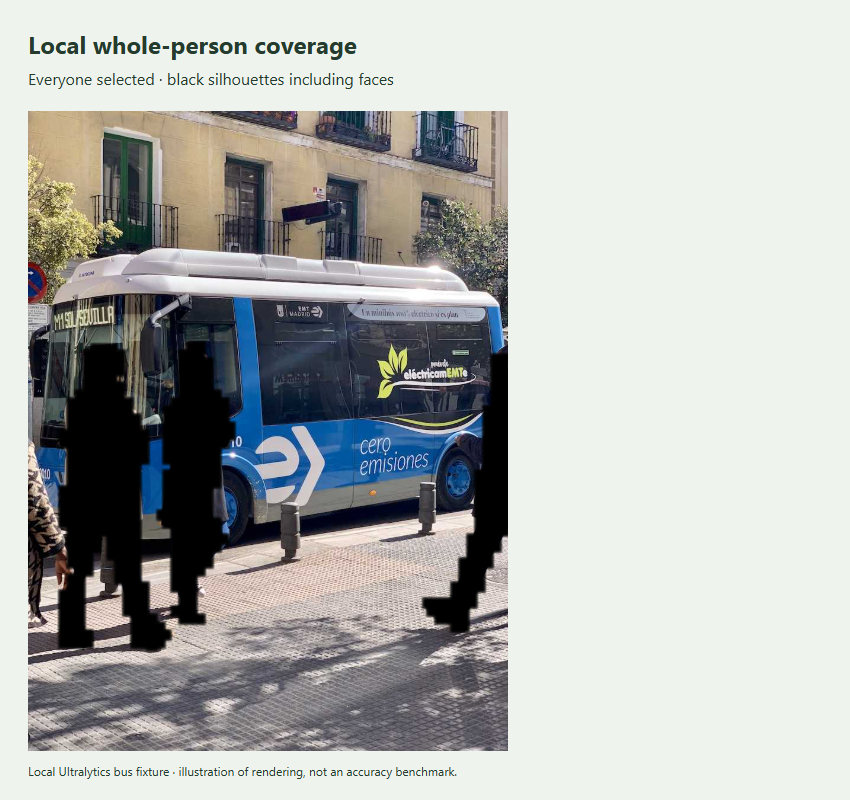
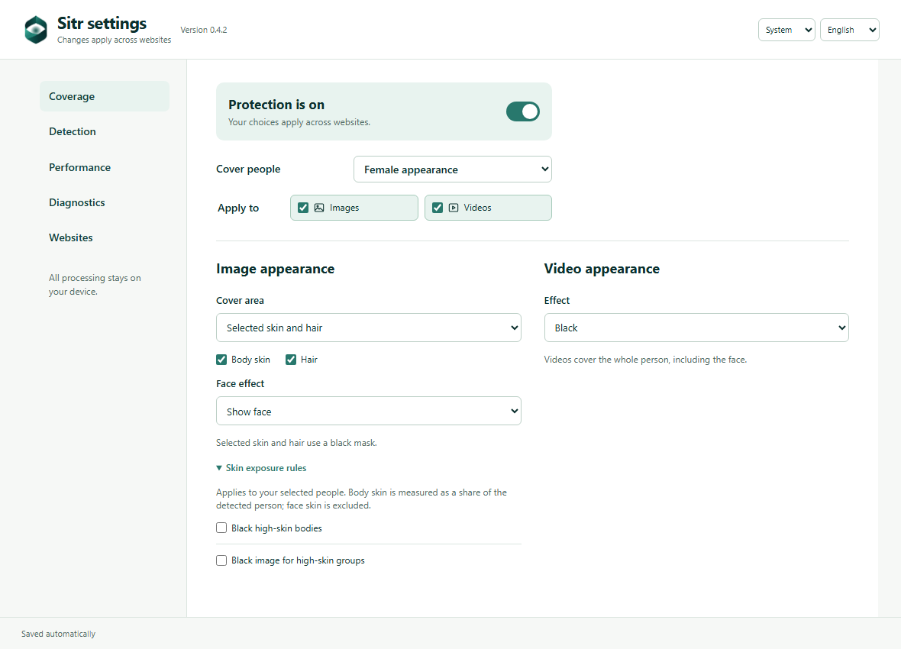

<p align="center"></p>

# Sitr · ستر

**Private image and video filtering, processed on your device.**

Sitr is a Chrome extension that covers selected people in supported images and videos. Choose skin and hair coverage or whole-person coverage, use black masks, blur, or a pixelated mosaic, and tune images and videos separately. English and Arabic interfaces include light, dark, and system themes.



**Requires Chrome 148 or newer.** Sitr uses local AI estimates that can miss people, misclassify appearance, or leave parts of moving media uncovered. It does not guarantee that every unwanted image or video frame is hidden. [Supported media and limitations](#supported-media-and-limitations).

## Install

### From a GitHub release

1. Open this repository's **Releases** page and download `sitr-0.4.2-chrome.zip` and `SHA256SUMS.txt`.
2. Verify the ZIP's SHA-256 against the checksum file, then extract it into a permanent folder. Do not load the ZIP itself.
3. Visit `chrome://extensions`, turn on **Developer mode**, and choose **Load unpacked**.
4. Select the extracted folder containing `manifest.json`. Pin **Sitr** using Chrome's extensions menu.
5. Refresh any already-open website tabs and open Sitr's popup to choose your coverage.

The extension ZIP includes all models and inference runtimes. Python, Node.js, and a server are unnecessary for installation. This repository distributes unpacked builds; no Chrome Web Store listing is assumed.

To update, extract a new release into your existing extension folder, click **Reload** at `chrome://extensions`, and refresh website tabs. Keeping the same folder preserves the unpacked extension's identity and settings. To uninstall, choose **Remove**; Chrome removes its local extension settings.

### Build from source

Use **Node.js 22.12+**, npm, and Git. Model binaries live in release assets to keep the source repository small.

```sh
npm ci
# Download sitr-0.4.2-models.zip from this repository's Releases page first.
npm run models -- --archive /path/to/sitr-0.4.2-models.zip
npm run check
npm run build
npm run verify:release
```

Load `dist/` using the same Chrome steps above. Commands also work in PowerShell; use `npm.cmd` if your execution policy blocks `npm.ps1`. The model installer checks all thirteen pinned hashes before replacing files. For source-weight downloads, export instructions, and reproducibility details, see [models/README.md](models/README.md).

## What you can control

- **People:** female appearance, male appearance, everyone, or no one. Automatic labels estimate visible appearance; they do not establish identity or a person's gender. Unclassified people are covered by default.
- **Images:** cover skin and hair, a whole silhouette with a face opening, or the whole silhouette including the face. Faces can be shown, blacked out, blurred, or pixelated where the selected coverage permits it.
- **Videos:** whole-person silhouettes or faster conservative person boxes, with motion correction between sampled analyses. Select Smooth or Strict playback.
- **Effects:** black, normal blur, and checkerboard blur, with independent intensity, grayscale, and mask-expansion controls. Skin and hair regions use black masks.
- **Sites:** pause on the current site or maintain domain exceptions that also apply to its subdomains and embedded players.
- **Advanced settings:** separate appearance models, image detection gates, optional skin-coverage thresholds, model resolution, CPU threads, and diagnostic outlines.

<p> </p>

## Examples

| Goal | Settings |
|---|---|
| Cover everyone without depending on appearance classification | Set **Cover people → Everyone**, **Unclassified people → Censor** for both media types, and Images **Cover area → Whole body · same effect on face**. Use **Black** effects. |
| Cover female-appearance skin and hair | Keep the default **Female appearance** filter, image skin/hair coverage, and **Unclassified people → Censor**. The default leaves faces shown. |
| Blur whole people in images, pixelate them in videos | Choose an image whole-body mode and **Blur**; switch to **Videos** and choose **Checkerboard blur**. Adjust each intensity separately. |
| Keep one website unrestricted | Click **Pause on this site**. Use **All settings → Websites** for a list such as `example.com` or a pasted HTTP(S) URL, then click **Save websites**. |
| Diagnose an image that stays black | Open **All settings → Diagnostics**, inspect status, and retry the engine. Follow [troubleshooting](docs/TROUBLESHOOTING.md). |



The coverage example is a local fixture with **Everyone** selected; it demonstrates rendering, not accuracy on unseen content. The popup/settings images use deterministic test status data. The photograph is from Ultralytics assets; see [fixture attribution](tests/fixtures/README.md).



## Privacy

Inference runs locally using packaged models. Sitr has no analytics, account, telemetry, or inference server. Frames, crops, masks, and temporary tracks remain in memory; settings and theme/language preferences are stored in Chrome's local extension storage.

Sitr needs HTTP(S) host access to analyze page media and fetch unreadable images from their original URLs. Those requests may include existing cookies and are visible to the original website or CDN. A video CORS recovery check may reload a player once and briefly interrupt playback. See the full [privacy policy and permission explanation](PRIVACY.md).

## Supported media and limitations

Supported paths include regular images, readable sampled video, HTTP(S) iframes, media in shadow roots, and URL-based CSS background layers on HTML elements. Models prefer WebGPU with WASM fallback; cold startup can take seconds and performance depends on your device. Up to twenty detected people per analysis and two active videos are supported.

Animated images, DRM/unreadable streams, canvas players, browser-internal pages, pseudo-element backgrounds, `image-set()`, and many picture-in-picture/native-fullscreen paths are unsupported. Protected media can stay black after acquisition or model failure. Blur and mosaic can leave shapes recognizable. Strict playback reduces stale-mask display but still cannot guarantee complete coverage; Smooth may display an older mask longer.

This is a browser filtering aid. It does not interpret religious rules or determine whether content is permissible. Validate the settings on the content you use. [Detailed behavior](docs/USER_GUIDE.md), [architecture](docs/ARCHITECTURE.md), and [measured performance](BENCHMARK.md) explain the practical limits. Historical benchmark numbers are not a release-wide performance guarantee.

## Development and releases

```sh
npm run check                  # TypeScript and unit tests; no models needed
npx playwright install chromium
npm run build                  # Requires the verified model bundle
npm run test:browser            # UI, real extension, media and regression checks
npm run release                # Checks, build, browser suite, ZIPs and SHA-256
```

The release command writes the extension, corresponding source, and model ZIPs to `release/`. Publish all three together. [Validation results](docs/VALIDATION.md) · [Contribution guide](CONTRIBUTING.md) · [Release instructions](docs/RELEASING.md) · [Security reporting](SECURITY.md) · [Changelog](CHANGELOG.md).

## License

Copyright © 2026 Sitr contributors. Sitr's original source, documentation, and artwork are licensed under **GNU Affero General Public License version 3 only (`AGPL-3.0-only`)**. You may use, modify, and redistribute it under that license. There is no warranty. Read [LICENSE](LICENSE) and [corresponding-source instructions](SOURCE.md).

Bundled dependencies, pretrained models, and third-party test photographs retain their own licenses and attribution. See [NOTICE.md](NOTICE.md), [LICENSES/](LICENSES/), and [the pinned model manifest](models/artifacts.json). YOLO models use [Ultralytics' AGPL terms](https://www.ultralytics.com/license); including them is why this project uses GNU AGPL v3.
