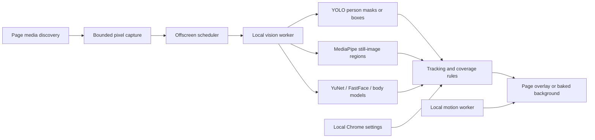

# Architecture

Sitr is a Manifest V3 extension for Chrome 148+. All executable assets and models
are packaged. There is no backend or remotely loaded inference code.

`src/content/index.ts` discovers eligible media, captures bounded frames, and
rejects results from stale sessions, source epochs, or settings revisions.
`src/media/mediaDiscovery.ts` handles the DOM and shadow roots; background-image
helpers preserve URL layers and CSS layout. Initial media protection is applied
before analysis. The overlay's first draw is committed before protection is
removed. Unsupported acquisition or failed inference keeps discovered media black.

`src/background/index.ts` serializes settings writes, creates the offscreen
document, and handles image acquisition under HTTP(S) host permissions.
`src/offscreen/index.ts` owns a bounded inference queue, validates session/tab/
frame/document ownership, enforces analysis timeouts, and retries failed engines
with fallback backends. `src/workers/index.ts` runs models and builds results.

YOLO WebGPU graphs retain FP32 weights and move TopK selection to TypeScript.
Original ONNX graphs are packaged for WASM fallback. MediaPipe runs for still
images; video avoids that stage. YuNet and FastFace use WASM. Optional Intel and
Paddle models classify person crops. The rules choose selected/unclassified
people, coverage regions, skin thresholds, and face effects. Tracking uses
temporary continuity evidence and resets on scene changes.

Video uses sampled inference with local motion-based mask translation between
analyses, not inference on every displayed frame. The mask renderer handles
letterboxing, object-fit, effects, diagnostic outlines, and geometry updates.
CSS backgrounds use a censored image copy with the original layout rules.

UI preferences are separate from inference settings. Theme/language changes
do not restart analysis. Settings schema normalization migrates prior values and
bounds model parameters. See `src/config/settings.ts`, `src/ui/localization.ts`,
and the unit/browser tests. Session data remains in memory; durable settings
use `chrome.storage.local`.
